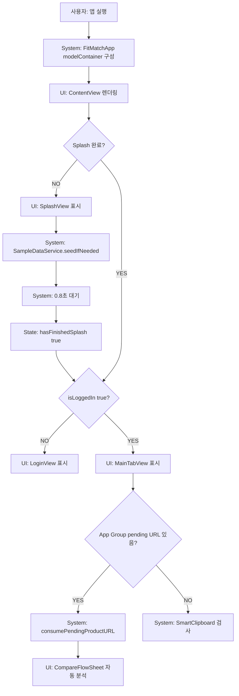

# 01. 앱 실행 전체 흐름

## ACT-APP-001 앱 실행

### 시작 조건
- 사용자가 FitMatch 앱 아이콘을 탭하거나 URL Scheme/Universal Link 후보로 앱이 열린다.

### 시스템 처리
1. `FitMatchApp`가 SwiftData `modelContainer`를 구성한다.
2. `ContentView`가 렌더링된다.
3. `.task`에서 `SampleDataService.seedIfNeeded(modelContext:brands:userFits:)` 실행.
4. 0.8초 `Task.sleep`.
5. `hasFinishedSplash = true`.
6. `openPendingSharedURLIfNeeded()` 호출.

### 호출 코드
- View: `ContentView`, `SplashView`, `LoginView`, `MainTabView`
- Service: `SampleDataService`, `SharedURLStore`
- Model: `Brand`, `UserFit`, `RecommendationHistory`

### 조건 분기
- `hasFinishedSplash == false`: `SplashView` 표시.
- `hasFinishedSplash == true && isLoggedIn == false`: `LoginView` 표시.
- `isLoggedIn == true`: `MainTabView` 표시.
- pending URL 있음: 로그인 상태 true, 홈 선택, `CompareFlowSheet(initialURL:)` 요청.
- pending URL 없음: Smart Clipboard 검사.

### 성공 결과
- 로그인 전이면 Login UI.
- 로그인 후 또는 pending URL이면 홈/비교 시트로 연결.

### 실패/예외
- SwiftData seed 저장은 `SampleDataService` 내부에서 `try?` 흐름이며 실패 UI 없음.
- `isLoggedIn`은 `@State`라 앱 재시작 시 로그인 유지 안 됨. 상태: BROKEN.

## ACT-APP-005 foreground 복귀

### 시스템 처리
- `ContentView.onChange(of: scenePhase)`에서 `.active` 감지.
- pending URL 우선 소비.
- pending URL 없으면 `inspectClipboardIfNeeded()`.

### 조건 분기
- pending URL 있음: 비교 플로우 시작, 클립보드 검사 안 함.
- pending URL 없음 + 로그인됨 + clipboardCandidate nil + 지원 URL 감지: Smart Clipboard sheet.
- 로그인 전/지원 URL 없음/오늘 mute/중복 URL: 아무 UI 없음.

### 예외
- 앱이 background 중 `CompareFlowSheet` Task를 실행 중이면 명시적 취소 처리 없음. 상태: PARTIAL.

## ACT-APP-007 URL Scheme `fitmatch://compare`

### 시스템 처리
1. `onOpenURL` 수신.
2. `isSupportedDeepLink` 검사.
3. route가 `compare`이면 `openCompareFromDeepLink`.
4. pending URL 있으면 consume 후 비교.
5. pending URL 없으면 URL 없는 compare sheet 표시.

### 실패
- scheme/host 미지원이면 로그만 출력, UI 없음.

