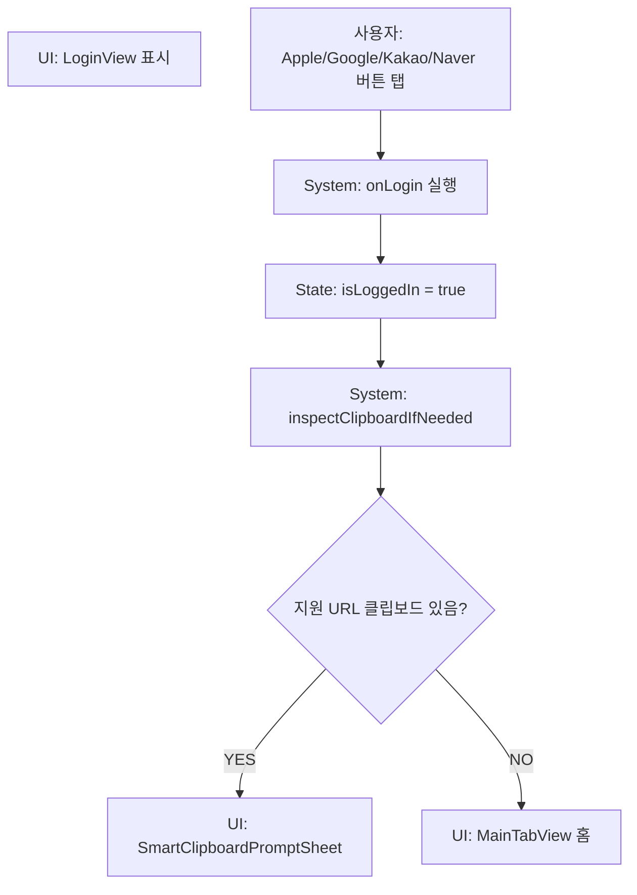

# 02. 인증 흐름

## ACT-AUTH-001 LoginView 진입

상태: `IMPLEMENTED` UI only, 실제 인증은 `PLANNED`.

### 사용자 행동
- Splash 이후 Apple/Google/Kakao/Naver 버튼 중 하나를 탭한다.

### 시스템 처리
1. `LoginButton`이 `onLogin` 실행.
2. `ContentView`에서 `isLoggedIn = true`.
3. `inspectClipboardIfNeeded()` 호출.
4. `MainTabView` 표시.

### 호출 코드
- View: `LoginView`, `LoginButton`
- State: `ContentView.isLoggedIn`
- Service: `SmartClipboardService`

### 조건 분기
- 버튼 종류에 따른 OAuth 분기 없음.
- 로그인 실패 경로 없음.
- 로그인 유지 저장 없음.

### 성공 결과
- 앱 메인 화면으로 진입.
- 클립보드에 지원 URL이 있으면 Smart Clipboard prompt가 뜰 수 있음.

### 실패/예외
- 실제 OAuth 실패, 취소, 권한 거절은 구현 안 됨.
- 앱 재실행 시 `isLoggedIn` 초기값 false로 LoginView 재표시.

## ACT-MY-003 로그아웃

### 시스템 처리
- `MyPageView`에서 전달된 `onLogout` 호출.
- `ContentView`: `isLoggedIn=false`, `selectedTab=.home`, `pendingCompareURL=nil`.

### 성공 결과
- LoginView로 이동.

### 미구현
- 서버 세션 종료, 토큰 삭제, 사용자 데이터 격리 없음.

