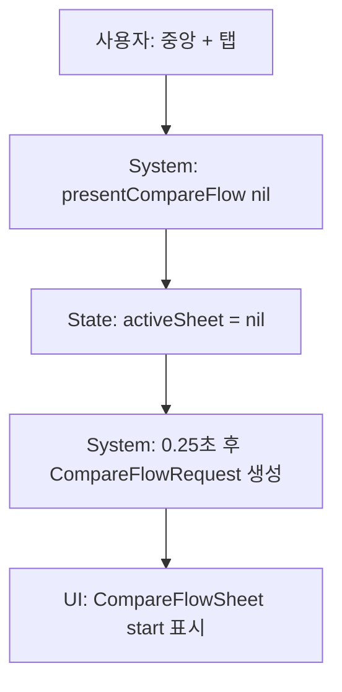

# 03. Navigation / Sheet 흐름

## 최종 하단 구조

상태: `IMPLEMENTED`.

- 홈: `selectedTab = .home`
- 기록: `selectedTab = .history`
- 중앙 +: 탭 아님, `presentCompareFlow(initialURL:nil)`
- 추천: `selectedTab = .recommend`
- 내 옷장: `selectedTab = .my`

`TabView`는 제거되었고 `MainTabView.currentTabContent`가 `switch selectedTab`으로 화면을 직접 렌더링한다.

## ACT-NAV-003 중앙 + 버튼

### 시스템 처리
1. `FitMatchBottomNavigationBar` 중앙 버튼 탭.
2. `MainTabView.presentCompareFlow(initialURL:nil)`.
3. `activeSheet = nil`.
4. 0.25초 후 `activeSheet = .compareFlow(CompareFlowRequest(initialURL:nil))`.
5. `.sheet(item:$activeSheet)` 하나만 표시.

### 호출 코드
- `ContentView.MainTabView`
- `MainActiveSheet.compareFlow`
- `CompareFlowSheet`

### 조건 분기
- 기존 sheet가 있으면 nil 처리 후 새 sheet.
- pending URL이 있으면 `initialURL` 포함.

### 실패/예외
- 0.25초 지연 사이 사용자가 다른 탭을 눌러도 sheet는 뜰 수 있음. 상태: PARTIAL.

## Sheet / Alert 목록

| 위치 | 타입 | 상태 | 역할 |
|---|---|---|---|
| `MainTabView` | `.sheet(item:$activeSheet)` | IMPLEMENTED | CompareFlow / SmartClipboard |
| `MyClosetView` | `.sheet(item:$activeSheet)` | IMPLEMENTED | 추가 방식/직접입력/링크등록 |
| `MyClosetView` | `.alert` | IMPLEMENTED | 기준 옷 변경 확인 |
| `ClosetItemDetailView` | `.sheet(isPresented:)` | IMPLEMENTED | 옷 수정 |
| `RecommendationResultView` | `.sheet(item:)` | IMPLEMENTED | 다른 옷 선택/내 옷장 추가 |
| `RecommendationHistoryView` | `.sheet(item:)` | IMPLEMENTED | 내 옷장 추가 |
| `AddComparedProductToClosetSheet` | `.alert` | IMPLEMENTED | 중복 저장 안내 |
| `ShoppingProductFormView` | `.sheet(item:)` | UNUSED | 이전 전체화면 비교 내부 sheet |

## 화면 이탈

- sheet dismiss 시 `activeSheet dismissed` 로그만 있고 내부 Task 취소는 없음.
- NavigationStack은 탭마다 새로 생성되며 탭 전환 시 이전 navigation path 보존 없음.

