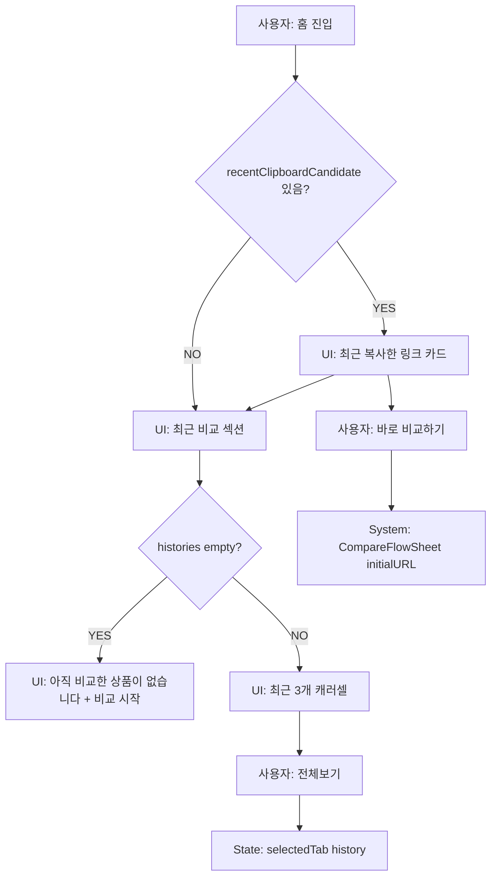

# 04. 홈 화면 행동 흐름

## 화면 구성

`HomeView`는 다음을 표시한다.

1. FitMatch wordmark/header.
2. 최근 복사한 링크 카드: `recentClipboardCandidate` 있을 때만.
3. 최근 비교한 상품: 최신 `RecommendationHistory` 3개 또는 empty state.
4. 광고 placeholder.

## ACT-HOME-002 최근 복사한 링크 바로 비교

### 입력값
- `SmartClipboardCandidate.urlString`
- `providerName`

### 시스템 처리
1. `PrimaryButton("바로 비교하기")`.
2. `onStartCompareWithURL(candidate.urlString)`.
3. `MainTabView.presentCompareFlow(initialURL:urlString)`.
4. `CompareFlowSheet.task`에서 자동 분석.

### 성공/실패
- 성공: 추천 결과 sheet.
- 실패: CompareFlowSheet error state.

## ACT-HOME-003 최근 비교 전체보기

### 시스템 처리
- `onOpenHistory` 호출.
- `selectedTab = .history`.

## ACT-HOME-004 최근 비교 카드 다시 비교

### 조건 분기
- `history.product.sourceURLString != nil`: `onRecompare(urlString)`.
- nil: 버튼 disabled/opacity 0.45.

### 이후 처리
- `ContentView.openCompare(with:)` → `CompareFlowSheet(initialURL)`.

## ACT-HOME-005 관심 토글

### 시스템 처리
- `FavoriteProductStore.toggle(productID:)`가 UserDefaults Set을 갱신한다.

### 저장 데이터
- UserDefaults key: `FitMatch.favoriteProductIDs`
- SwiftData 변경 없음.

## 미구현/주의

- 홈의 광고는 실제 SDK가 아닌 placeholder.
- 최근 복사한 링크 카드의 상품명/이미지는 클립보드 단계에서는 파싱하지 않아 provider/domain 위주 표시.

