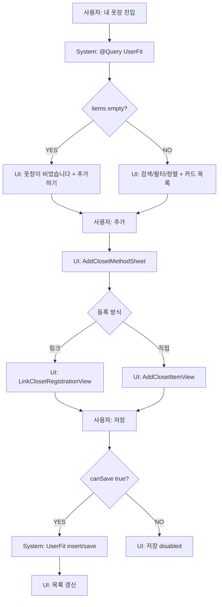

# 05. 내 옷장 흐름

## ACT-CLOSET-001 목록 조회

### 시스템 처리
- `MyClosetView`가 `@Query(sort:\UserFit.createdAt, order:.reverse)`로 옷장 데이터를 읽는다.
- `filteredItems`에서 검색/카테고리/브랜드/정렬 적용.

### UI
- 아이템 있음: `ClosetItemCard` 목록.
- 아이템 없음: `EmptyClosetView`.
- 필터 결과 없음: `EmptyFilterResultView`.

## ACT-CLOSET-006 옷 추가

### 시스템 처리
1. 상단/empty add 버튼 탭.
2. `activeSheet = .addMethod`.
3. `AddClosetMethodSheet` 표시.
4. 선택지:
   - 상품 링크로 불러오기 → `.linkRegistration`
   - 직접 입력하기 → `.manualAdd`

### 분기
- 링크 등록: `LinkClosetRegistrationView`.
- 직접 입력: `AddClosetItemView`.

## ACT-CLOSET-008 직접 입력 저장

### 입력값
- sourceType/sourceName/brand/gender/category/detailCategory/productName/measurements/fitPreference/isRepresentative.

### 시스템 처리
1. `AddClosetItemViewModel.canSave` 검사.
2. 저장 버튼 enabled.
3. `makeItem()` 생성.
4. `modelContext.insert(item)`.
5. `try? modelContext.save()`.

### 실패
- 필수값 누락 또는 실측 숫자 변환 실패: 저장 버튼 disabled.
- SwiftData 저장 실패: UI 없음.

## ACT-CLOSET-009 상세/수정

### 시스템 처리
- `ClosetItemCard` 내부 `NavigationLink` → `ClosetItemDetailView`.
- 수정 버튼 → `AddClosetItemView(item:)` sheet.
- 저장 시 기존 item 필드 update.

## ACT-CLOSET-011 삭제

### 시스템 처리
- swipe action delete 또는 삭제 함수.
- `modelContext.delete(item)`.
- `try? modelContext.save()`.

### 예외
- 삭제 실패 UI 없음.
- 기준 옷 삭제 후 자동 대체 지정 없음. 다음 비교 시 기준 없음 분기.

