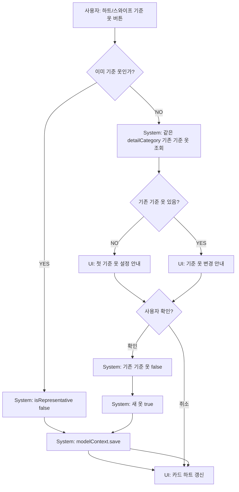

# 06. 기준 옷 흐름

## 의미

UI 명칭은 “기준 옷”이며 내부 필드는 `UserFit.isRepresentative`를 사용한다.

## ACT-REF-001 기준 옷 지정

### 사용자 행동
- 내 옷장 카드의 하트 버튼 또는 leading swipe action을 누른다.

### 시스템 처리
1. `MyClosetView.prepareBasisChange(for:)`.
2. 기존 같은 `detailCategory` 기준 옷 조회.
3. alert 표시.
4. 확인 시 `confirmBasisChange()`.
5. 같은 detailCategory 기존 기준 옷 `isRepresentative=false`.
6. 새 item `isRepresentative=true`.
7. `try? modelContext.save()`.

### 조건 분기
- 현재 item이 이미 기준 옷: 즉시 해제.
- 같은 detailCategory 기준 옷 없음: 첫 설정 안내.
- 기존 기준 옷 있음: “기존 기준 옷 해제 후 새 기준 옷” 안내.

## ACT-REF-003 기준 옷 해제

### 시스템 처리
- item.isRepresentative false.
- 저장.

### 실패
- 저장 실패 UI 없음.

## 위험

- `try? save`라 실패 시 하트 UI가 메모리상 바뀌었지만 영구 저장 안 될 수 있음.
- 여러 디바이스/동기화는 없음.

