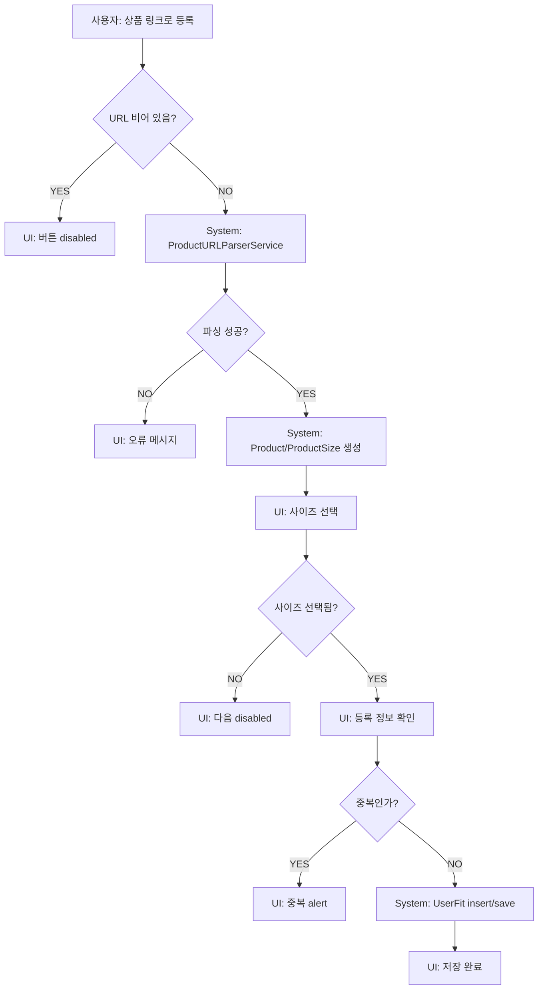

# 07. 상품 등록 흐름

## URL 기반 옷장 등록

구현 위치:
- `LinkClosetRegistrationView`
- `AddComparedProductToClosetSheet`
- `CompareFlowSheet` 내부 등록 단계

## ACT-REG-001 내 옷장 > 상품 링크로 불러오기

### 시스템 처리
1. URL 입력.
2. `ProductURLParserService.parse(urlString:)`.
3. `ParsedProductInfo`를 `Product`/`ProductSize`로 변환.
4. `isShowingAddToClosetSheet = true`.
5. `AddComparedProductToClosetSheet`.
6. 사이즈 선택.
7. 등록 정보 확인.
8. `UserFit` 생성 및 저장.

### 조건 분기
- URL empty: 버튼 disabled.
- parser 성공: product 생성.
- partial: 일부 정보 적용 가능하지만 size 없으면 sheet에서 사이즈 없음.
- parser 실패: `errorMessage` 표시.
- 중복: alert “이미 내 옷장에 등록된 사이즈입니다.”

## ACT-REG-002 비교 결과 > 이 상품 내 옷장에 추가

### 시스템 처리
- `RecommendationResultView` 또는 `CompareFlowSheet.result`에서 시작.
- 기존 `Product`와 `ProductSize` 사용.
- 추천 사이즈 기본 선택하지 않는 흐름은 `CompareFlowSheet`에서 준수.
- `AddComparedProductToClosetSheet`는 selectedSizeID 초기값 nil이므로 기본 선택 없음.

## ACT-REG-003 등록 후 원래 비교 자동 재개

### 구현
- `CompareFlowSheet.saveRegisteredProductAndResumeCompare()`.
- UserFit 저장 후 0.45초 뒤 `calculateAndSaveTemporaryRecommendation(selectedReferenceItem:item)`.

### 위험
- 저장 실패해도 `try?`라 성공 메시지/자동 비교가 진행될 수 있음. 위험도 High.

