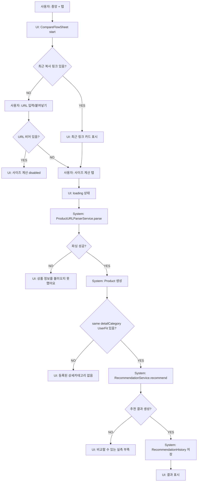

# 08. URL 입력/중앙 + 비교 흐름

## ACT-COMPARE-001 중앙 + → URL 입력

### 시작 조건
- 사용자가 하단 중앙 + 버튼을 탭.
- `MainActiveSheet.compareFlow`가 표시됨.

### 입력값
- `initialURL`: nil 또는 공유/pending/재비교 URL.
- `recentClipboardCandidate`.
- 현재 `UserFit` 목록.

### 시스템 처리
1. `CompareFlowSheet.start`.
2. 직접 URL 입력 또는 붙여넣기.
3. `startCompare(with:)`.
4. URL trim.
5. `ShoppingProductViewModel.loadProductInfoFromURL`.
6. `ProductURLParserService.parse`.
7. `Product` 생성.
8. same detail closet item 조회.
9. 있으면 추천 계산/저장/결과.
10. 없으면 missing reference UI.

### 조건 분기
- URL empty: CTA disabled.
- URL invalid: parser throws `invalidURL` → error state.
- Musinsa: MusinsaParser.
- Non-Musinsa: GenericProductParser → 현재 실패.
- same detail item 없음: 등록/다른 옷 선택.
- same detail item 있음: 추천 계산.
- 추천 불가: error state.

## 취소/이탈

- 사용자가 sheet를 내리면 내부 Task 취소 없음.
- URL 입력값은 sheet 생명주기 내 `@State`; dismiss 후 초기화.

