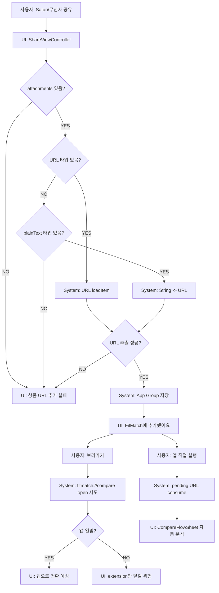

# 09. Share Extension 흐름

## ACT-SHARE-001 공유 URL 저장

### 시스템 처리
1. `ShareViewController.viewDidLoad`.
2. `handleSharedContent`.
3. `extensionContext.inputItems.first` 확인.
4. attachment URL 타입 우선.
5. 없으면 plainText 타입을 URL로 변환.
6. `UserDefaults(suiteName:"group.io.github.ljy4337.FitMatch")`에 저장.
7. 완료 UI 표시.

### 저장 데이터
- `pendingProductURL`
- `pendingProductURLCreatedAt`

### 실패
- attachment 없음, URL/text 없음, text가 URL 변환 불가: 실패 UI.

## ACT-SHARE-004 보러가기

### 시스템 처리
- `fitmatch://compare` 생성.
- responder chain에서 `UIApplication` 탐색.
- 찾으면 `application.open(url, options:)`.
- 0.7초 후 `completeRequest`.

### 문제
- `open` completion success가 false여도 completeRequest가 예약될 수 있다.
- iOS Extension 정책상 containing app open은 불안정하다.
- 상태: BROKEN 가능성.

## 앱 직접 실행 이어가기

### 시스템 처리
- `ContentView.task` 또는 foreground에서 `SharedURLStore.consumePendingProductURL`.
- UserDefaults에서 URL 제거 후 문자열 반환.
- `openCompare(with:)` → `CompareFlowSheet(initialURL)`.

