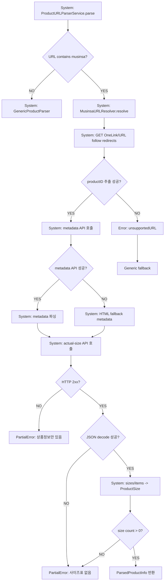

# 10. 무신사 파싱 흐름

## Parser 우선순위

1. `ProductURLParserService.normalizedURL`.
2. URL 문자열에 `musinsa` 포함 여부.
3. 포함 시 `MusinsaParser`.
4. 실패 시 `GenericProductParser` fallback.
5. Generic은 현재 항상 `automaticParsingUnavailable`.

## OneLink 리다이렉트

### 시스템 처리
- `MusinsaURLResolver.resolve`.
- `followRedirects`: GET 요청, URLSession 자동 redirect.
- `response.url`와 body에서 productID 추출.
- 패턴:
  - `products/(\d+)`
  - `products%2[fF](\d+)`
  - `/goods/(\d+)`
  - `goods%2[fF](\d+)`
  - `goodsNo[=:](\d+)`

## actual-size API

### 호출 URL
`https://goods-detail.musinsa.com/api2/goods/{productID}/actual-size`

### 처리
- JSON decode: `MusinsaActualSizeResponse`.
- `data.sizes[]`.
- size.name empty면 제외.
- items name/value를 measurement alias로 매핑.
- 모든 측정값 0이면 size 제외.

## metadata API

### 호출 URL
`https://goods-detail.musinsa.com/api2/goods/{productID}`

### 처리
- 상품명 `goodsNm`.
- 브랜드 `brandInfo.brandName` → `brandEnglishName` → `brand` → `Musinsa`.
- 카테고리 depth1/2/base path에서 map.
- 이미지 URL normalize.
- API 실패 시 HTML fallback.

## 예외 처리 상태

| 예외 | 상태 |
|---|---|
| OneLink redirect network failure | PARTIAL: catch 후 fallback |
| productID 없음 | PARTIAL: unsupported → Generic 실패 |
| actual-size 404/500 | PARTIAL: metadata partial error |
| JSON 구조 변경 | PARTIAL: partial error |
| metadata API 실패 | IMPLEMENTED: HTML fallback |
| image relative path | IMPLEMENTED: normalizeImageURL |

