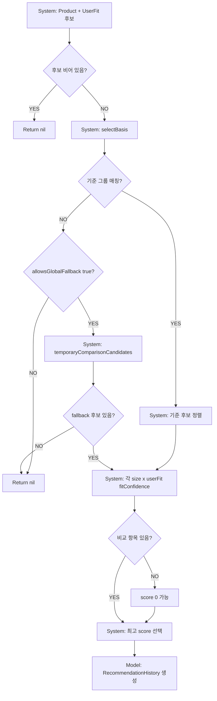

# 11. 추천 계산 흐름

## ACT-REC-001 자동 추천

### 시스템 처리
1. `CompareFlowSheet`에서 `sameDetailItems` 조회.
2. 같은 detailCategory가 하나라도 있으면 추천 진행.
3. `RecommendationService.recommend(product:userFits:productDetailCategory:allowsGlobalFallback:true)`.
4. `selectBasis`.
5. 각 product size × userFit 조합의 Fit Confidence 계산.
6. score 최대, 동점이면 평균 차이 작은 결과 선택.
7. `RecommendationHistory` 생성.
8. `saveUniqueHistory`.

### 기준 선택 우선순위
`RecommendationService.selectBasis`:
1. 같은 source + brand + detailCategory + 기준 옷.
2. 같은 brand + detailCategory + 기준 옷.
3. 같은 source + detailCategory + 기준 옷.
4. 같은 detailCategory + 기준 옷.
5. allowsGlobalFallback true면 `temporaryComparisonCandidates`.
6. 없으면 빈 basis.

주의: `CompareFlowSheet`가 same detail 목록만 넘기는 경우 source/brand 범위는 해당 목록 내에서만 평가된다.

## ACT-REC-002 사용자 선택 임시 비교

- `RecommendationService.recommend(product:selectedReferenceItem:)`.
- comparisonMethod: `사용자 선택 임시 비교`.
- fallbackReason 포함.
- scorePenalty 필드는 있으나 현재 Fit Confidence score에서 실제 감점 적용은 코드상 확인되지 않는다. 상태: PARTIAL.

## 저장

- `CompareFlowSheet.saveUniqueHistory`는 같은 상품 기록을 삭제 후 새 기록을 insert.
- 중복 기준: sourceURL, productCode, brand+name.
- 삭제/저장 실패 UI 없음.

