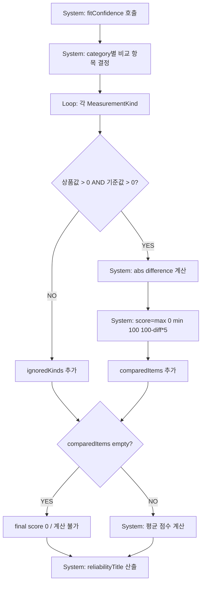

# 12. Fit Confidence 상세

## 현재 코드 공식

`RecommendationService.fitConfidence`:

- 항목별 점수: `max(0, min(100, Int((100 - difference * 5).rounded())))`
- 누락 항목: productValue <= 0 또는 referenceValue <= 0이면 `ignoredKinds`.
- 최종 점수: 비교된 항목 점수 평균.
- 비교 항목 없음: score 0, averageDifference `.greatestFiniteMagnitude`.

기획 공식과 거의 동일하다. 단, 비교 항목 0개일 때 결과 생성을 막지는 않고 score 0 결과가 선택될 수 있다.

## 카테고리별 항목

- 상의/아우터/셔츠/니트: 어깨, 가슴, 총장, 소매.
- 하의/팬츠: 허리, 힙, 허벅지, 총장.
- 기타는 `ClothingCategory.measurementKinds`.

## 비교 신뢰도

`FitConfidenceResult.reliabilityTitle`:
- 4개 이상: 높은 신뢰도.
- 3개: 충분한 비교.
- 2개: 참고 가능.
- 1개: 참고용.
- 0개: 계산 불가.

## 분기 분석

| 경우 | 처리 |
|---|---|
| 차이 0cm | 100점 |
| 차이 1cm | 95점 |
| 차이 2cm | 90점 |
| 차이 20cm 이상 | 0점 |
| 상품값 0/nil 표현 | 계산 제외 |
| 기준값 0/nil 표현 | 계산 제외 |
| 음수 값 | `>0` 조건 실패 시 제외 |
| 모든 항목 누락 | score 0, 결과 생성 가능 |

## 코드와 기획 차이

- 기획: 0개 항목이면 계산 불가 표시가 필요.
- 현재 추천 서비스: 0점 `RecommendationHistory`가 생성될 수 있음. 결과 UI는 “정보 부족” 처리 일부가 있으나 추천 자체 차단은 아님.
- 기획: 비교 방식별 감점 명시.
- 현재: `scorePenalty`를 `RecommendationBasis`에 저장하지만 Fit Confidence에 적용하는 코드가 확인되지 않음.

