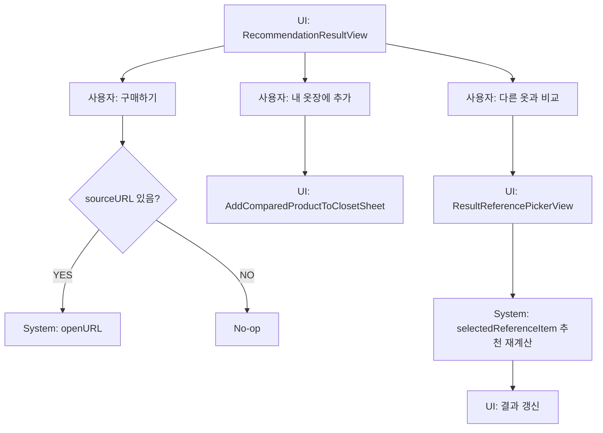

# 13. 추천 결과 화면 흐름

## ACT-RESULT-001 결과 확인

### UI
- Hero: 추천 사이즈, Fit Confidence, 신뢰도 문구.
- 상품 정보: 이미지/브랜드/상품명/출처/카테고리.
- 기준 옷 카드.
- 실측 차이.
- 추천 이유.
- Fit Match 순위.
- 액션: 내 옷장 추가, 구매하기, 기록 보기, 다른 옷과 비교.

### 호출 코드
- `RecommendationResultView`
- `RecommendationService.rankedFitMatches`
- `AddComparedProductToClosetSheet`
- `ResultReferencePickerView`

## ACT-RESULT-002 구매하기

- `openURL(url)` 호출.
- sourceURL nil이면 동작 불가 또는 no-op.

## ACT-RESULT-003 다른 옷과 비교

1. `activeSheet = .referencePicker`.
2. `ResultReferencePickerView` 표시.
3. 사용자 선택.
4. `RecommendationService.recommend(product:selectedReferenceItem:)`.
5. `displayResult` 갱신.

### 저장
- 이 경로의 재계산 결과 저장 여부는 화면 코드에서 제한적이며, 기존 result 화면 표시 갱신 중심. 상태: PARTIAL.

## ACT-RESULT-004 내 옷장에 추가

- `AddComparedProductToClosetSheet`.
- 저장 성공 시 alert “내 옷장에 추가했어요.”

