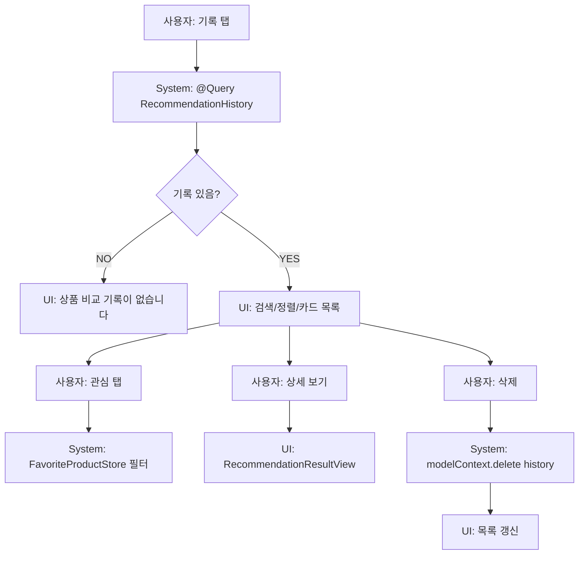

# 14. 기록 흐름

## ACT-HISTORY-001 목록 조회

### 시스템 처리
- `RecommendationHistoryView`가 `@Query(sort:\RecommendationHistory.createdAt, order:.reverse)`로 조회.
- favorite 여부는 `FavoriteProductStore` UserDefaults에서 조회.

### 필터/정렬
- 전체/관심 segmented.
- 검색어: 브랜드/상품명.
- 정렬: 최신순, 오래된순, 브랜드순, Fit Confidence순.

## ACT-HISTORY-005 상세 보기

- `HistoryCard`의 `NavigationLink` → `RecommendationResultView(result:)`.

## ACT-HISTORY-006 내 옷장에 추가

- `selectedHistoryForCloset = history`.
- sheet `AddComparedProductToClosetSheet(product:history.product, recommendedSize:history.recommendedSize)`.
- 저장 완료 alert.

## ACT-HISTORY-009 삭제

### 시스템 처리
- `modelContext.delete(history)`.
- `try? modelContext.save()`.

### 예외
- product 관계 삭제 여부는 `RecommendationHistory` 모델 delete rule 명시가 보이지 않으므로 product orphan 가능성 검토 필요.

