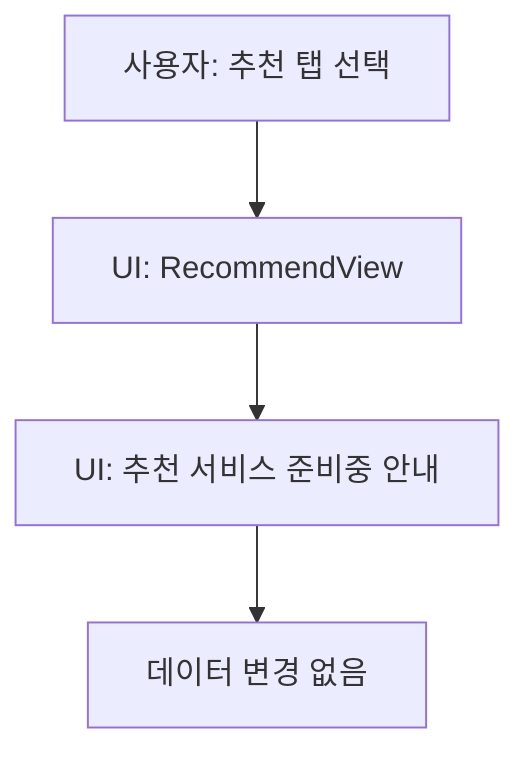

# 15. 추천 탭 흐름

## ACT-RECOMMEND-001 추천 탭 확인

상태: `PARTIAL`.

### 현재 구현
- `RecommendView`는 실제 추천 상품 데이터가 아닌 준비중/placeholder 성격의 UI를 표시한다.
- 광고/AI 추천, 구매 링크, 개인화 추천 알고리즘은 구현되지 않았다.

### 사용자 행동
- 하단 추천 탭 탭.
- Coming Soon 정보 확인.

### 데이터
- SwiftData 조회 없음 또는 추천에 영향을 주는 저장 없음.

## PLANNED

- AI/광고 기반 추천 상품.
- 관심상품 기반 가격 추적.
- 브랜드/핏 선호 기반 추천.

