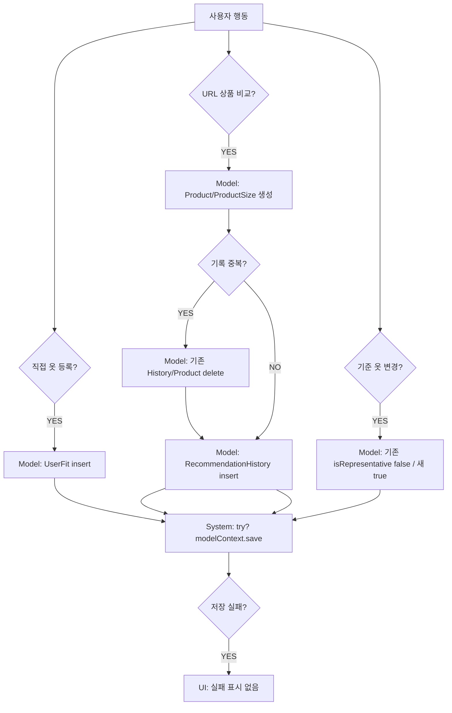

# 16. SwiftData CRUD 흐름

## 모델 목록

| Model | 역할 |
|---|---|
| `Brand` | 브랜드 마스터. `Product.brand`와 연결 |
| `Product` | 비교/등록 상품. sourceType/sourceName/sourceURL/image/sizes 보유 |
| `ProductSize` | 상품 사이즈별 실측 |
| `UserFit` | 사용자가 저장한 내 옷/기준 옷 |
| `RecommendationHistory` | 추천 결과 기록 |

## 생성

| 생성 위치 | Model | 비고 |
|---|---|---|
| `SampleDataService.seedIfNeeded` | Brand/UserFit | 첫 실행 sample |
| `AddClosetItemView` | UserFit | 직접 입력 |
| `LinkClosetRegistrationView` | Brand/Product/ProductSize/UserFit | 링크 등록 |
| `AddComparedProductToClosetSheet` | UserFit | 비교 상품 등록 |
| `CompareFlowSheet.saveRegisteredProductAndResumeCompare` | UserFit | BottomSheet 등록 |
| `CompareFlowSheet.saveUniqueHistory` | Product/RecommendationHistory | 비교 결과 저장 |
| `ShoppingProductFormView.saveUniqueHistory` | Product/RecommendationHistory | UNUSED 비교 화면 |

## 조회

- `@Query Brand`, `@Query UserFit`, `@Query RecommendationHistory`.
- Favorite은 SwiftData가 아니라 UserDefaults.

## 수정

- `AddClosetItemView(item:)`에서 UserFit 필드 update.
- 기준 옷 변경에서 여러 UserFit의 `isRepresentative` update.
- Favorite은 UserDefaults update.

## 삭제

- `MyClosetView.deleteItems` → UserFit delete.
- `RecommendationHistoryView.deleteHistory` → RecommendationHistory delete.
- `CompareFlowSheet.saveUniqueHistory` → duplicate history/product delete.

## 위험

- 대부분 `try? modelContext.save()`라 실패 알림 없음.
- Product와 History delete 관계 정리 명확성 필요.

