# 18. 상태 전이 분석

## CompareFlowSheet 상태 전이

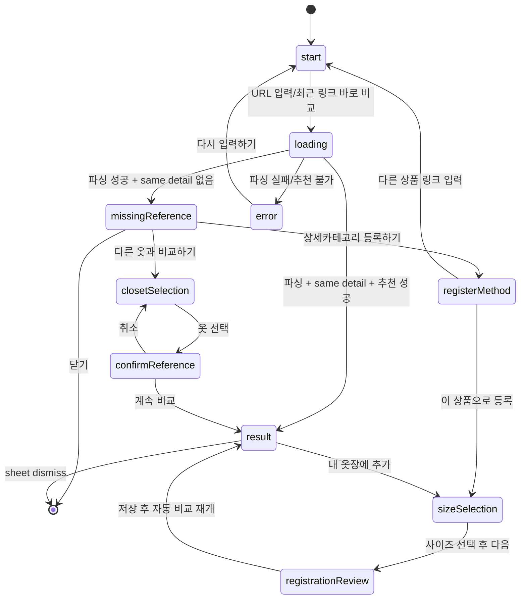
```mermaid
stateDiagram-v2
    [*] --> start
    start --> loading: URL 입력/최근 링크 바로 비교
    loading --> result: 파싱 + same detail + 추천 성공
    loading --> missingReference: 파싱 성공 + same detail 없음
    loading --> error: 파싱 실패/추천 불가
    missingReference --> registerMethod: 상세카테고리 등록하기
    missingReference --> closetSelection: 다른 옷과 비교하기
    missingReference --> [*]: 닫기
    registerMethod --> sizeSelection: 이 상품으로 등록
    registerMethod --> start: 다른 상품 링크 입력
    sizeSelection --> registrationReview: 사이즈 선택 후 다음
    registrationReview --> result: 저장 후 자동 비교 재개
    closetSelection --> confirmReference: 옷 선택
    confirmReference --> result: 계속 비교
    confirmReference --> closetSelection: 취소
    result --> sizeSelection: 내 옷장에 추가
    result --> [*]: sheet dismiss
    error --> start: 다시 입력하기
```

## 앱 상태 전이

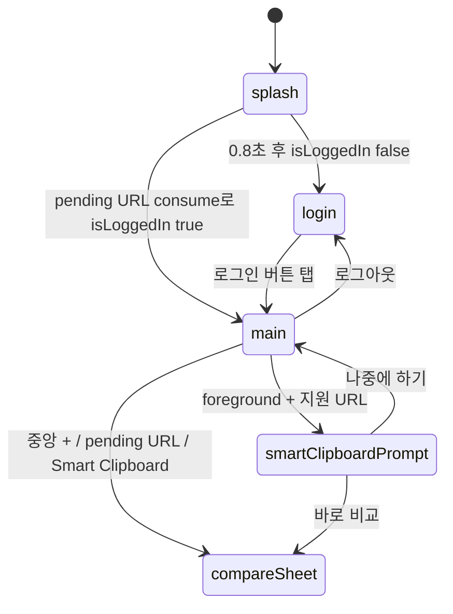
```mermaid
stateDiagram-v2
    [*] --> splash
    splash --> login: 0.8초 후 isLoggedIn false
    splash --> main: pending URL consume로 isLoggedIn true
    login --> main: 로그인 버튼 탭
    main --> compareSheet: 중앙 + / pending URL / Smart Clipboard
    main --> login: 로그아웃
    main --> smartClipboardPrompt: foreground + 지원 URL
    smartClipboardPrompt --> compareSheet: 바로 비교
    smartClipboardPrompt --> main: 나중에 하기
```

## RecommendationService 상태

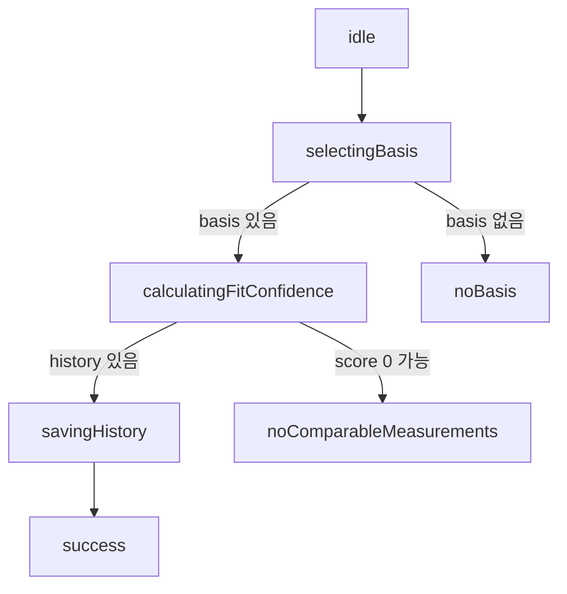
```mermaid
flowchart TD
    A[idle]
    B[selectingBasis]
    C[calculatingFitConfidence]
    D[savingHistory]
    E[success]
    F[noBasis]
    G[noComparableMeasurements]
    A --> B
    B -->|basis 있음| C
    B -->|basis 없음| F
    C -->|history 있음| D --> E
    C -->|score 0 가능| G
```

## 취소 가능성

| 상태 | 취소 가능 | 재시도 가능 | 보존 데이터 |
|---|---|---|---|
| start | 가능 | 가능 | 입력 URL |
| loading | sheet dismiss 가능 | 가능 | Task 취소 없음 |
| missingReference | 가능 | 가능 | parsed product in ViewModel |
| sizeSelection | 가능 | 가능 | selectedSizeID |
| registrationReview | 가능 | 가능 | registration fields |
| result | 가능 | 재비교 가능 | SwiftData history 저장됨 |

## 필수 기능별 Mermaid 흐름도 40개

### 1. 앱 실행 전체 흐름
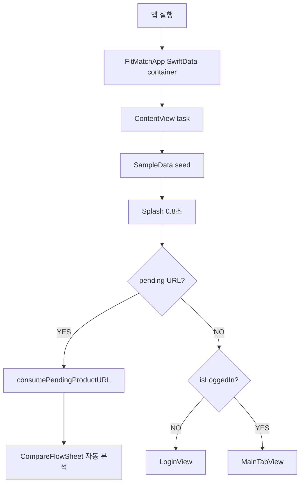
```mermaid
flowchart TD
A[앱 실행]-->B[FitMatchApp SwiftData container]-->C[ContentView task]
C-->D[SampleData seed]-->E[Splash 0.8초]-->F{pending URL?}
F--YES-->G[consumePendingProductURL]-->H[CompareFlowSheet 자동 분석]
F--NO-->I{isLoggedIn?}
I--NO-->J[LoginView]
I--YES-->K[MainTabView]
```

### 2. 로그인 흐름
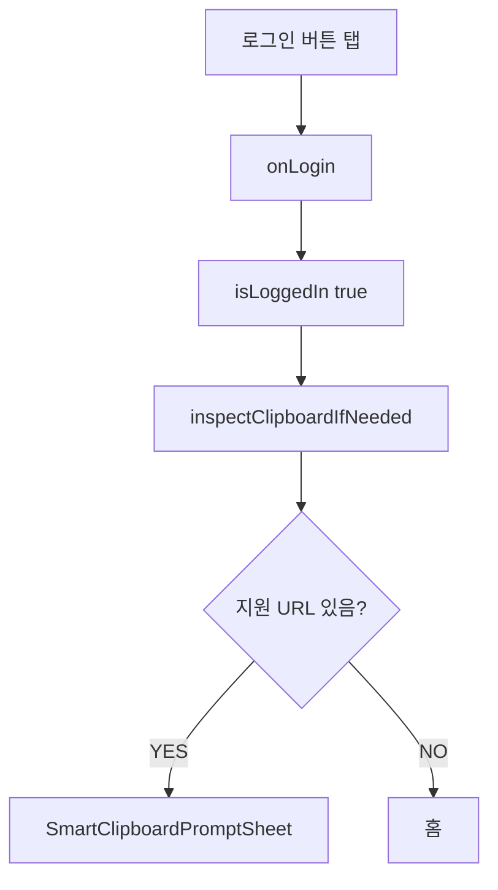
```mermaid
flowchart TD
A[로그인 버튼 탭]-->B[onLogin]-->C[isLoggedIn true]-->D[inspectClipboardIfNeeded]
D-->E{지원 URL 있음?}
E--YES-->F[SmartClipboardPromptSheet]
E--NO-->G[홈]
```

### 3. 하단 탭 이동 흐름
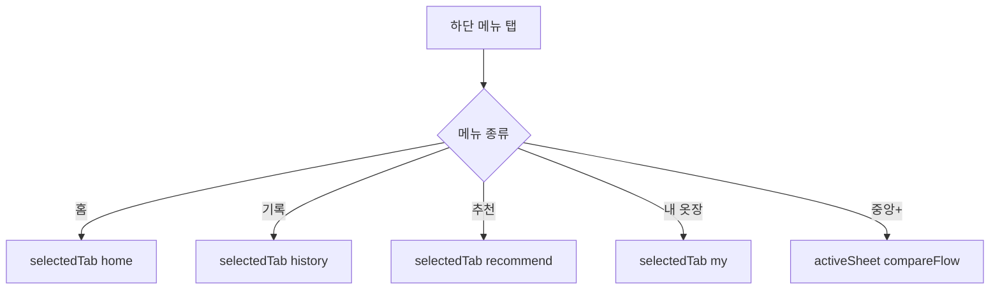
```mermaid
flowchart TD
A[하단 메뉴 탭]-->B{메뉴 종류}
B--홈-->C[selectedTab home]
B--기록-->D[selectedTab history]
B--추천-->E[selectedTab recommend]
B--내 옷장-->F[selectedTab my]
B--중앙+-->G[activeSheet compareFlow]
```

### 4. 홈 화면 행동 흐름
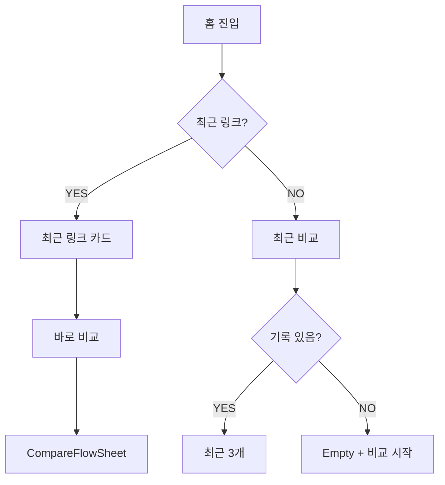
```mermaid
flowchart TD
A[홈 진입]-->B{최근 링크?}
B--YES-->C[최근 링크 카드]
B--NO-->D[최근 비교]
C-->E[바로 비교]-->F[CompareFlowSheet]
D-->G{기록 있음?}
G--YES-->H[최근 3개]
G--NO-->I[Empty + 비교 시작]
```

### 5. 내 옷장 목록 흐름
```mermaid
flowchart TD
A[내 옷장 탭]-->B[@Query UserFit]-->C[검색/필터/정렬]
C-->D{결과 있음?}
D--YES-->E[ClosetItemCard 목록]
D--NO-->F[EmptyCloset/EmptyFilter]
```

### 6. 옷 수동 등록 흐름
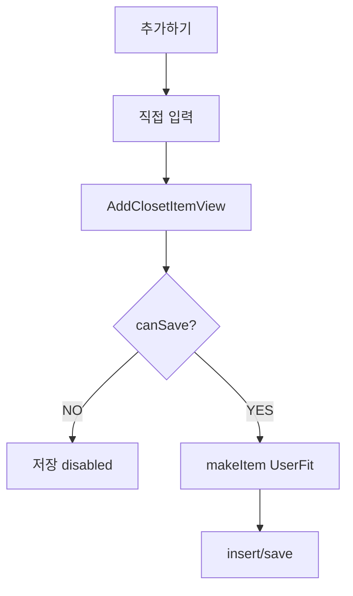
```mermaid
flowchart TD
A[추가하기]-->B[직접 입력]-->C[AddClosetItemView]
C-->D{canSave?}
D--NO-->E[저장 disabled]
D--YES-->F[makeItem UserFit]-->G[insert/save]
```

### 7. 옷 수정 흐름
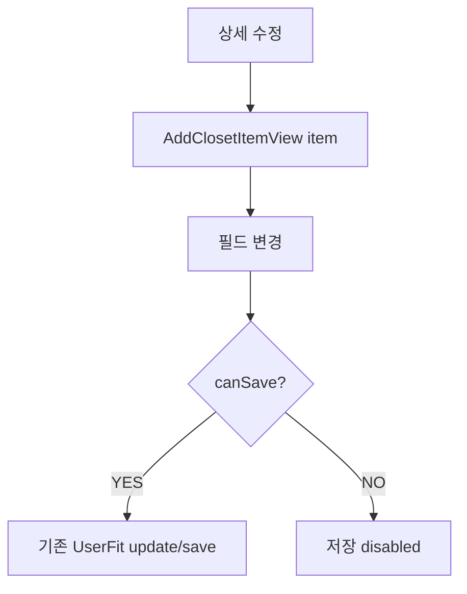
```mermaid
flowchart TD
A[상세 수정]-->B[AddClosetItemView item]-->C[필드 변경]
C-->D{canSave?}
D--YES-->E[기존 UserFit update/save]
D--NO-->F[저장 disabled]
```

### 8. 옷 삭제 흐름
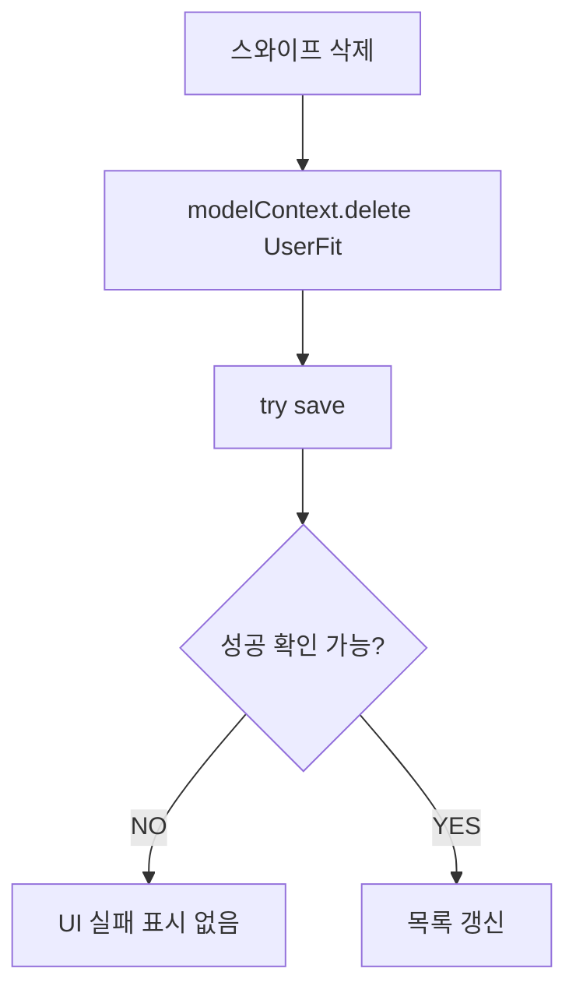
```mermaid
flowchart TD
A[스와이프 삭제]-->B[modelContext.delete UserFit]-->C[try save]
C-->D{성공 확인 가능?}
D--NO-->E[UI 실패 표시 없음]
D--YES-->F[목록 갱신]
```

### 9. 기준 옷 지정 흐름
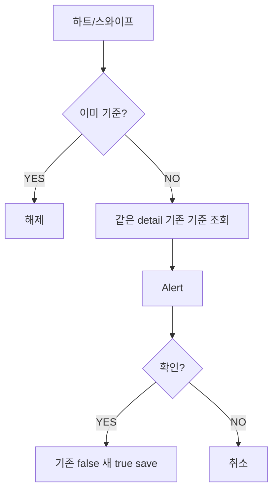
```mermaid
flowchart TD
A[하트/스와이프]-->B{이미 기준?}
B--YES-->C[해제]
B--NO-->D[같은 detail 기존 기준 조회]-->E[Alert]-->F{확인?}
F--YES-->G[기존 false 새 true save]
F--NO-->H[취소]
```

### 10. 기준 옷 변경 흐름
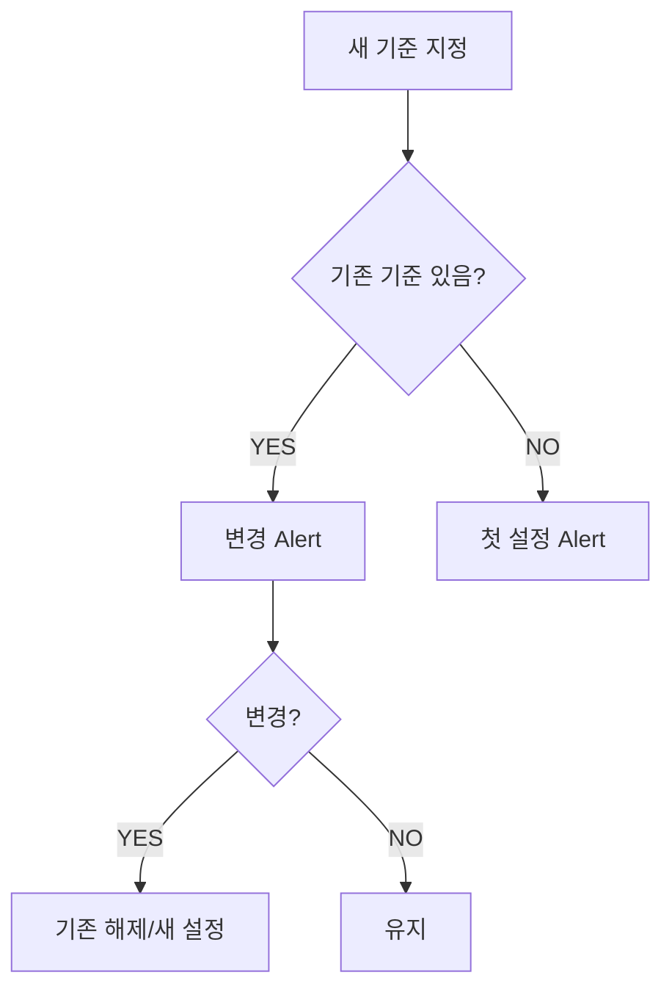
```mermaid
flowchart TD
A[새 기준 지정]-->B{기존 기준 있음?}
B--YES-->C[변경 Alert]
B--NO-->D[첫 설정 Alert]
C-->E{변경?}
E--YES-->F[기존 해제/새 설정]
E--NO-->G[유지]
```

### 11. 기준 옷 해제 흐름
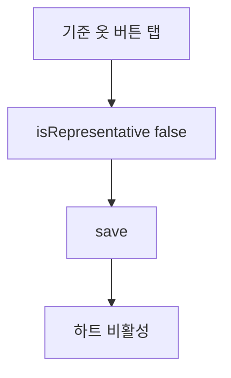
```mermaid
flowchart TD
A[기준 옷 버튼 탭]-->B[isRepresentative false]-->C[save]-->D[하트 비활성]
```

### 12. URL 직접 입력 흐름
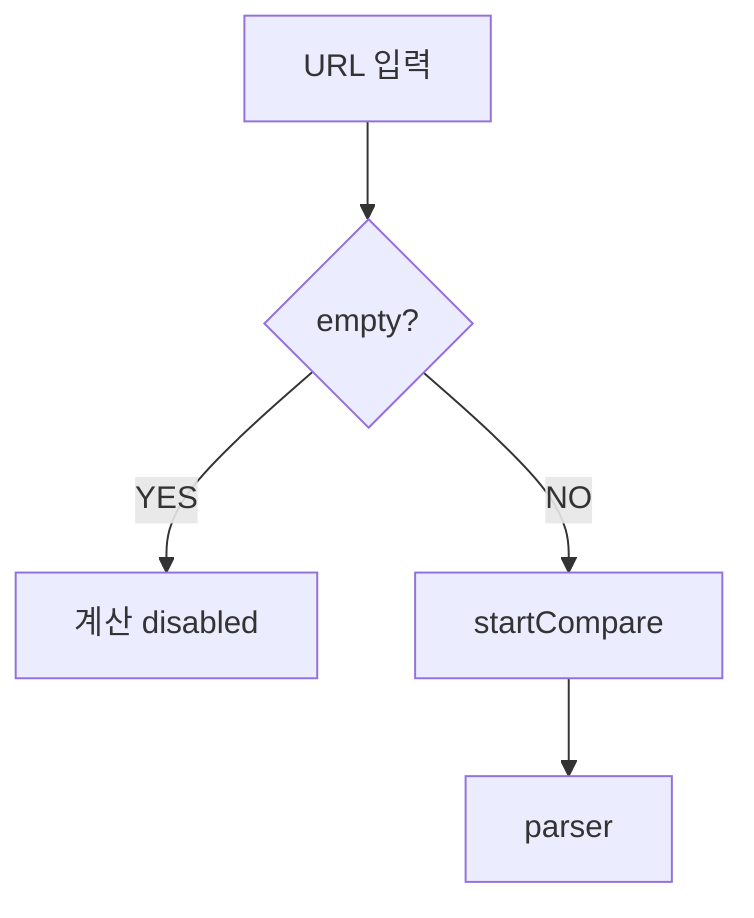
```mermaid
flowchart TD
A[URL 입력]-->B{empty?}
B--YES-->C[계산 disabled]
B--NO-->D[startCompare]-->E[parser]
```

### 13. 클립보드 URL 흐름
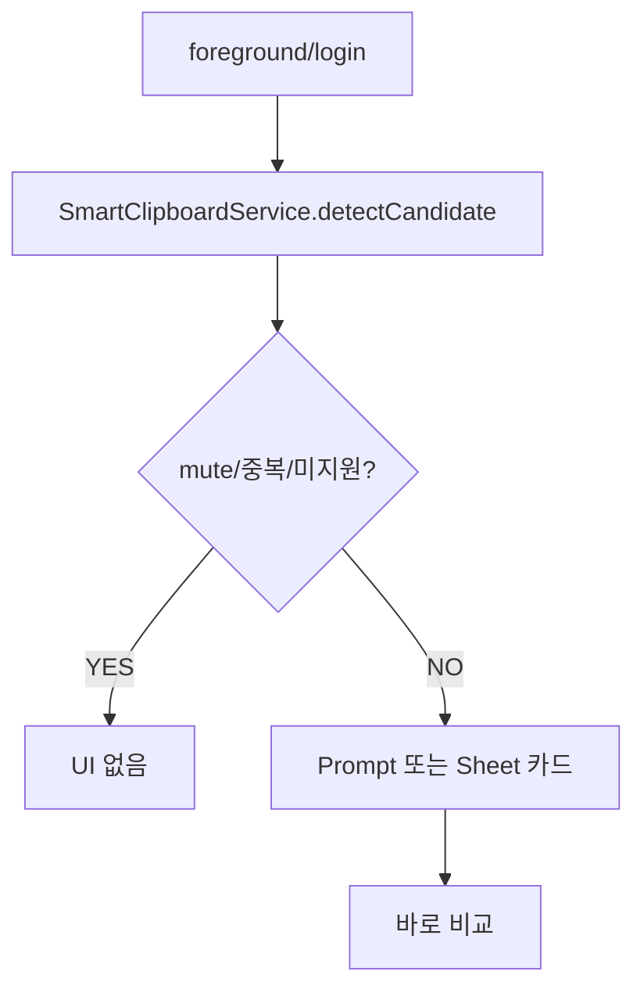
```mermaid
flowchart TD
A[foreground/login]-->B[SmartClipboardService.detectCandidate]
B-->C{mute/중복/미지원?}
C--YES-->D[UI 없음]
C--NO-->E[Prompt 또는 Sheet 카드]
E-->F[바로 비교]
```

### 14. Share Extension 흐름
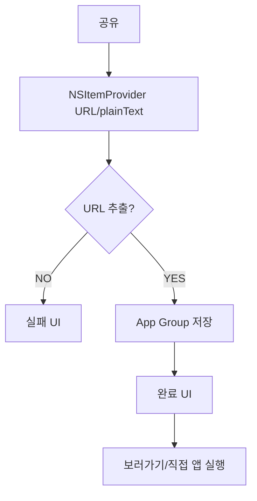
```mermaid
flowchart TD
A[공유]-->B[NSItemProvider URL/plainText]-->C{URL 추출?}
C--NO-->D[실패 UI]
C--YES-->E[App Group 저장]-->F[완료 UI]-->G[보러가기/직접 앱 실행]
```

### 15. OneLink 리다이렉트 흐름
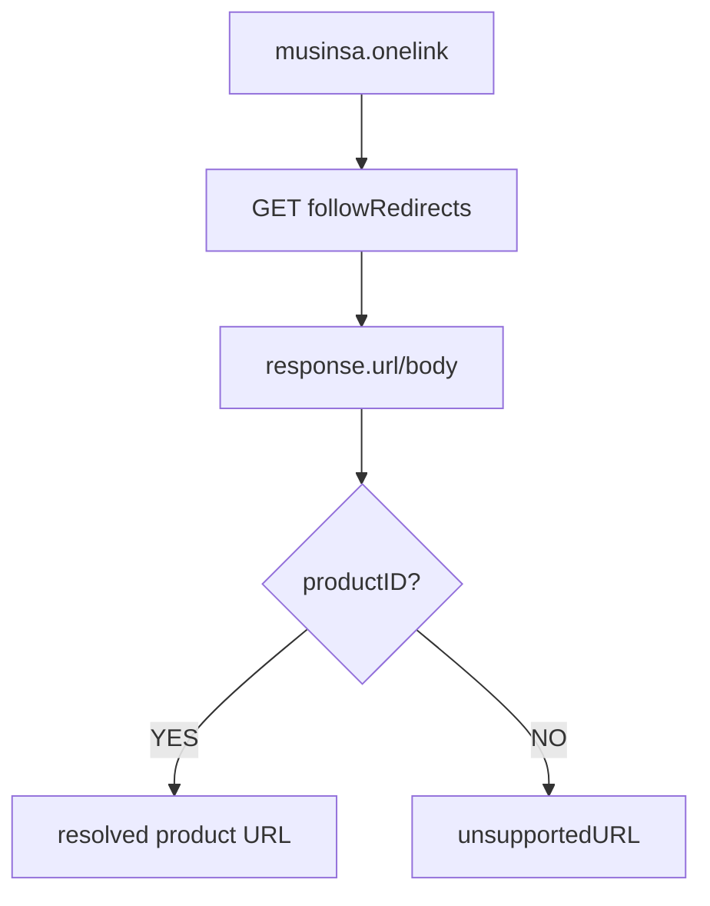
```mermaid
flowchart TD
A[musinsa.onelink]-->B[GET followRedirects]-->C[response.url/body]
C-->D{productID?}
D--YES-->E[resolved product URL]
D--NO-->F[unsupportedURL]
```

### 16. 무신사 상품번호 추출 흐름
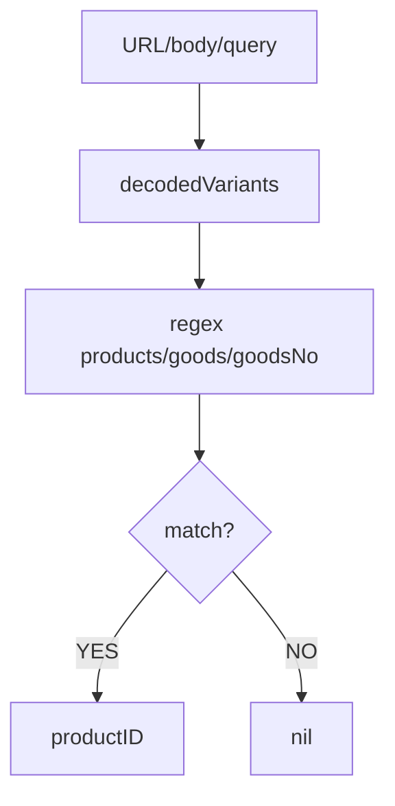
```mermaid
flowchart TD
A[URL/body/query]-->B[decodedVariants]-->C[regex products/goods/goodsNo]
C-->D{match?}
D--YES-->E[productID]
D--NO-->F[nil]
```

### 17. Actual Size API 호출 흐름
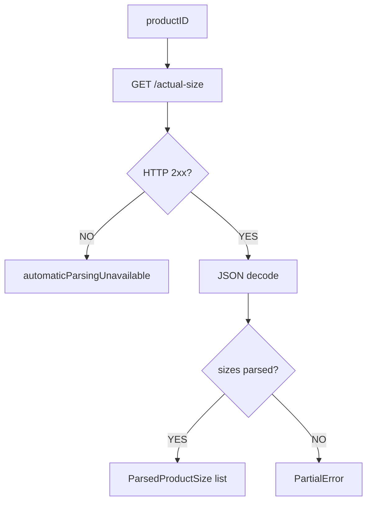
```mermaid
flowchart TD
A[productID]-->B[GET /actual-size]-->C{HTTP 2xx?}
C--NO-->D[automaticParsingUnavailable]
C--YES-->E[JSON decode]-->F{sizes parsed?}
F--YES-->G[ParsedProductSize list]
F--NO-->H[PartialError]
```

### 18. 상품 정보 파싱 흐름
```mermaid
flowchart TD
A[productID]-->B[metadata API]-->C{성공?}
C--YES-->D[brand/name/category/image/price]
C--NO-->E[HTML fallback]
E-->F[title/og:image/canonical]
```

### 19. 사이즈표 파싱 흐름
```mermaid
flowchart TD
A[data.sizes]-->B[loop size]
B-->C{name empty?}
C--YES-->D[exclude]
C--NO-->E[items alias mapping]-->F{측정값 하나 이상?}
F--YES-->G[ParsedProductSize]
F--NO-->D
```

### 20. Parser fallback 흐름
```mermaid
flowchart TD
A[ProductURLParserService]-->B{musinsa?}
B--YES-->C[MusinsaParser]
C-->D{성공?}
D--YES-->E[ParsedProductInfo]
D--NO-->F[GenericProductParser]
F-->G{성공?}
G--NO-->H[automaticParsingUnavailable]
B--NO-->F
```

### 21. 상품 이미지 로딩 흐름
```mermaid
flowchart TD
A[imageURLString]-->B{nil/invalid?}
B--YES-->C[placeholder]
B--NO-->D[AsyncImage]-->E{success?}
E--YES-->F[scaledToFill image]
E--NO-->C
```

### 22. detailCategory 판별 흐름
```mermaid
flowchart TD
A[categoryText + productName]-->B[mapDetailCategory keyword]
B-->C{keyword match?}
C--YES-->D[matched detailCategory]
C--NO-->E[other]
```

### 23. 기준 옷 자동 선택 흐름
```mermaid
flowchart TD
A[Product + userFits]-->B[selectBasis]
B-->C{source+brand+detail basis?}
C--YES-->D[use it]
C--NO-->E{brand+detail basis?}
E--YES-->D
E--NO-->F{source+detail basis?}
F--YES-->D
F--NO-->G{detail basis?}
G--YES-->D
G--NO-->H[fallback/none]
```

### 24. 동일 detailCategory 사용자 선택 흐름
```mermaid
flowchart TD
A[same detail 없음]-->B[MissingReference]
B-->C[옷장 속 다른 옷과 비교]
C-->D[same category candidates]
D-->E[사용자 선택]-->F[확인]-->G[temp recommend]
```

### 25. TOP3 후보 추천 흐름
```mermaid
flowchart TD
A[temporaryComparisonCandidates]-->B{same detail 있음?}
B--YES-->C[same detail sorted]
B--NO-->D[rankedFitMatches]-->E[prefix 3]
```

### 26. 추천 사이즈 계산 흐름
```mermaid
flowchart TD
A[product sizes x userFits]-->B[fitConfidence]
B-->C{score best?}
C--YES-->D[bestHistory 갱신]
C--NO-->E[유지]
D-->F[RecommendationHistory]
```

### 27. Fit Confidence 계산 흐름
```mermaid
flowchart TD
A[측정 항목]-->B{양쪽 값 > 0?}
B--NO-->C[ignored]
B--YES-->D[100-diff*5]
D-->E[평균]
```

### 28. 비교 신뢰도 계산 흐름
```mermaid
flowchart TD
A[comparedItems.count]-->B{count}
B--4+-->C[높은 신뢰도]
B--3-->D[충분한 비교]
B--2-->E[참고 가능]
B--1-->F[참고용]
B--0-->G[계산 불가]
```

### 29. 누락 실측값 처리 흐름
```mermaid
flowchart TD
A[product/reference value]-->B{둘 다 >0?}
B--YES-->C[score 반영]
B--NO-->D[ignoredKinds]-->E[감점 없음]
```

### 30. 다른 옷과 비교하기 흐름
```mermaid
flowchart TD
A[다른 옷과 비교]-->B[ReferencePicker/closetSelection]
B-->C[사용자 선택]-->D[확인]
D-->E[RecommendationService selectedReferenceItem]
```

### 31. 추천 결과 저장 흐름
```mermaid
flowchart TD
A[history 생성]-->B[duplicateHistories]
B-->C{중복 있음?}
C--YES-->D[기존 history/product delete]
C--NO-->E[skip]
D-->F[insert product/history]
E-->F-->G[save]
```

### 32. 추천 결과 화면 흐름
```mermaid
flowchart TD
A[RecommendationHistory]-->B[Hero]
B-->C[상품/기준옷/실측/이유]
C-->D{사용자 액션}
D--구매-->E[openURL]
D--추가-->F[AddComparedProductToClosetSheet]
D--다른옷-->G[ReferencePicker]
```

### 33. 기록 목록 흐름
```mermaid
flowchart TD
A[기록 탭]-->B[@Query histories]-->C[scope/search/sort]
C-->D{empty?}
D--YES-->E[Empty]
D--NO-->F[HistoryCard]
```

### 34. 기록 상세 흐름
```mermaid
flowchart TD
A[HistoryCard 탭]-->B[NavigationLink]-->C[RecommendationResultView]-->D[결과 액션]
```

### 35. 다시 비교 흐름
```mermaid
flowchart TD
A[다시 비교]-->B{sourceURL 있음?}
B--NO-->C[disabled]
B--YES-->D[openCompare]-->E[CompareFlowSheet initialURL]
```

### 36. 기록 삭제 흐름
```mermaid
flowchart TD
A[기록 삭제]-->B[modelContext.delete]-->C[try save]-->D[목록 갱신 또는 실패 표시 없음]
```

### 37. 추천 탭 흐름
```mermaid
flowchart TD
A[추천 탭]-->B[RecommendView]-->C[준비중 placeholder]-->D[데이터 변경 없음]
```

### 38. 외부 쇼핑몰 이동 흐름
```mermaid
flowchart TD
A[쇼핑몰 이동/구매하기]-->B{URL 있음?}
B--YES-->C[openURL or UIApplication.open]
B--NO-->D[disabled/no-op]
```

### 39. SwiftData CRUD 흐름
```mermaid
flowchart TD
A[사용자 저장/삭제]-->B{작업}
B--등록-->C[insert]
B--수정-->D[field update]
B--삭제-->E[delete]
C-->F[try? save]
D-->F
E-->F
F-->G{실패 UI?}
G--NO-->H[위험]
```

### 40. 앱 오류 및 복구 흐름
```mermaid
flowchart TD
A[오류 발생]-->B{Parser/Network?}
B--YES-->C[errorMessage/error state]
B--NO-->D{Storage?}
D--YES-->E[대부분 UI 없음]
D--NO-->F{Input?}
F--YES-->G[disabled/alert]
F--NO-->H[로그만]
```
